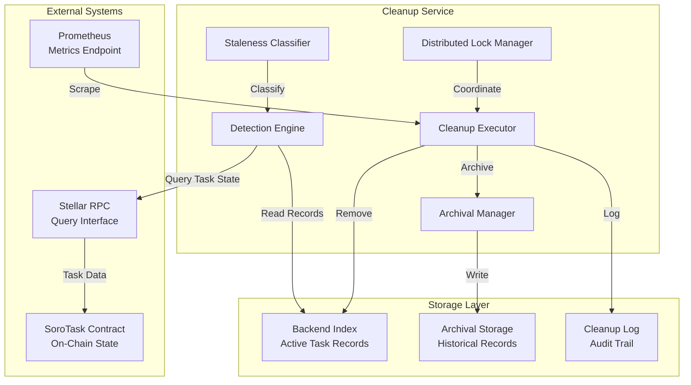

# Design Document: Stale Task Cleanup

## Overview

The Stale Task Cleanup feature provides a safe, auditable mechanism for detecting and removing obsolete task records from backend indexes while preserving debugging history. This system addresses data hygiene concerns in the SoroTask ecosystem where backend read models can accumulate stale records due to task cancellations, prolonged pauses, or abandonment.

### Problem Statement

The SoroTask contract manages task lifecycle on-chain, but backend indexers maintain separate read models for monitoring and analytics. These read models can become stale when:
- Tasks are cancelled and removed from on-chain storage
- Tasks remain paused for extended periods
- Tasks are abandoned (active but with zero gas balance and no recent execution)

Stale records pollute operator dashboards, skew analytics, and increase storage costs without providing value.

### Solution Approach

The Cleanup Service implements a three-phase workflow:
1. **Detection Phase**: Query on-chain state to identify stale records based on configurable criteria
2. **Review Phase**: Present findings to operators for approval (or apply automatic cleanup with conservative thresholds)
3. **Cleanup Phase**: Archive records to long-term storage, then remove from active indexes

This design prioritizes safety through:
- Non-destructive detection
- Mandatory archival before deletion
- Comprehensive audit logging
- Idempotent operations
- Distributed locking for concurrent safety

## Architecture

### System Components



### Component Responsibilities

**Detection Engine**
- Scans Backend_Index for all task records
- Queries on-chain state via RPC for each task_id
- Compares indexed state with on-chain state
- Applies rate limiting to RPC queries (10 queries/second)
- Handles query errors gracefully without blocking detection

**Staleness Classifier**
- Applies configurable rules from Retention_Policy
- Classifies records into: Cancelled, Paused_Stale, Abandoned, or Active
- Enforces grace period for newly created tasks
- Calculates staleness duration for each record

**Archival Manager**
- Copies complete task records to Archival_Storage
- Includes all task configuration fields and execution history
- Adds metadata: cleanup_timestamp, classification_reason, staleness_duration
- Supports querying archived records by task_id, creator, timestamp range

**Cleanup Executor**
- Orchestrates the cleanup workflow
- Enforces approval requirements (manual or automatic with thresholds)
- Performs transactional removal from Backend_Index
- Writes audit entries to Cleanup_Log
- Emits metrics for monitoring

**Distributed Lock Manager**
- Acquires distributed lock before cleanup operations
- Implements lock heartbeat mechanism
- Handles lock timeout and recovery from crashed instances
- Releases lock on completion or failure

### Deployment Architecture

The Cleanup Service can be deployed in two modes:

**Manual Mode** (Recommended for initial deployment)
- Operator triggers detection via CLI or API
- Review detection report
- Explicitly approve cleanup operations
- Suitable for low-volume environments or cautious operators

**Automatic Mode** (For mature deployments)
- Scheduled execution (e.g., daily cron job)
- Automatic cleanup for records exceeding conservative thresholds (30+ days)
- Alert on high failure rates
- Suitable for high-volume environments with established policies

## Data Models

### Backend_Index Schema

The Backend_Index is the active read model that mirrors on-chain task state. This design assumes a relational database schema, but the model can be adapted to document stores or key-value stores.

```sql
CREATE TABLE backend_tasks (
    task_id BIGINT PRIMARY KEY,
    creator VARCHAR(56) NOT NULL,  -- Stellar address
    target VARCHAR(56) NOT NULL,
    function VARCHAR(32) NOT NULL,
    args JSONB NOT NULL,
    resolver VARCHAR(56),
    interval BIGINT NOT NULL,
    last_run BIGINT NOT NULL,
    gas_balance BIGINT NOT NULL,
    whitelist JSONB NOT NULL,  -- Array of addresses
    is_active BOOLEAN NOT NULL,
    blocked_by JSONB NOT NULL,  -- Array of task_ids
    created_at TIMESTAMP NOT NULL,
    updated_at TIMESTAMP NOT NULL,
    indexed_at TIMESTAMP NOT NULL,
    
    INDEX idx_last_run (last_run),
    INDEX idx_is_active (is_active),
    INDEX idx_gas_balance (gas_balance),
    INDEX idx_created_at (created_at)
);
```

**Field Descriptions:**
- `task_id`: Unique sequential identifier from SoroTask contract
- `creator`: Address that registered the task
- `target`: Contract address to invoke
- `function`: Function name to call on target
- `args`: JSON-encoded function arguments
- `resolver`: Optional condition-checking contract address
- `interval`: Minimum seconds between executions
- `last_run`: Ledger timestamp of last execution
- `gas_balance`: Remaining gas tokens for execution fees
- `whitelist`: Authorized keeper addresses (empty = any keeper)
- `is_active`: Whether task is active or paused
- `blocked_by`: Task IDs that must execute before this task
- `created_at`: Timestamp when task was registered on-chain
- `updated_at`: Timestamp of last on-chain state change
- `indexed_at`: Timestamp when backend last indexed this record

### Archival_Storage Schema

Archival_Storage preserves historical records for debugging and compliance. Records are immutable once archived.

```sql
CREATE TABLE archived_tasks (
    archive_id BIGSERIAL PRIMARY KEY,
    task_id BIGINT NOT NULL,
    creator VARCHAR(56) NOT NULL,
    target VARCHAR(56) NOT NULL,
    function VARCHAR(32) NOT NULL,
    args JSONB NOT NULL,
    resolver VARCHAR(56),
    interval BIGINT NOT NULL,
    last_run BIGINT NOT NULL,
    gas_balance BIGINT NOT NULL,
    whitelist JSONB NOT NULL,
    is_active BOOLEAN NOT NULL,
    blocked_by JSONB NOT NULL,
    created_at TIMESTAMP NOT NULL,
    updated_at TIMESTAMP NOT NULL,
    indexed_at TIMESTAMP NOT NULL,
    
    -- Cleanup metadata
    cleanup_timestamp TIMESTAMP NOT NULL,
    classification_reason VARCHAR(32) NOT NULL,  -- 'cancelled', 'paused_stale', 'abandoned'
    staleness_duration_days INTEGER NOT NULL,
    operator_identity VARCHAR(256),  -- User or service account that approved cleanup
    archival_location VARCHAR(512),  -- Storage path or identifier
    
    INDEX idx_task_id (task_id),
    INDEX idx_creator (creator),
    INDEX idx_cleanup_timestamp (cleanup_timestamp),
    INDEX idx_classification_reason (classification_reason)
);

-- Execution history is also archived
CREATE TABLE archived_task_executions (
    execution_id BIGSERIAL PRIMARY KEY,
    archive_id BIGINT REFERENCES archived_tasks(archive_id),
    task_id BIGINT NOT NULL,
    execution_timestamp TIMESTAMP NOT NULL,
    keeper_address VARCHAR(56) NOT NULL,
    fee_paid BIGINT NOT NULL,
    success BOOLEAN NOT NULL,
    error_message TEXT,
    
    INDEX idx_archive_id (archive_id),
    INDEX idx_task_id (task_id)
);
```

**Retention Policy:**
- Archived records retained for minimum 365 days
- After retention period, records can be moved to cold storage or deleted
- Execution history linked to archived tasks via `archive_id`

### Cleanup_Log Schema

The Cleanup_Log provides a complete audit trail of all cleanup operations.

```sql
CREATE TABLE cleanup_log (
    log_id BIGSERIAL PRIMARY KEY,
    task_id BIGINT NOT NULL,
    cleanup_timestamp TIMESTAMP NOT NULL,
    classification_reason VARCHAR(32) NOT NULL,
    staleness_duration_days INTEGER NOT NULL,
    operator_identity VARCHAR(256),
    archival_location VARCHAR(512),
    operation_type VARCHAR(16) NOT NULL,  -- 'cleanup', 'restore', 'dry_run'
    operation_mode VARCHAR(16) NOT NULL,  -- 'manual', 'automatic'
    success BOOLEAN NOT NULL,
    error_message TEXT,
    
    -- Metrics
    detection_duration_ms INTEGER,
    archival_duration_ms INTEGER,
    cleanup_duration_ms INTEGER,
    
    INDEX idx_task_id (task_id),
    INDEX idx_cleanup_timestamp (cleanup_timestamp),
    INDEX idx_operation_type (operation_type),
    INDEX idx_success (success)
);

-- Aggregate metrics table for monitoring
CREATE TABLE cleanup_metrics (
    metric_id BIGSERIAL PRIMARY KEY,
    run_timestamp TIMESTAMP NOT NULL,
    records_scanned INTEGER NOT NULL,
    records_classified_stale INTEGER NOT NULL,
    records_cleaned INTEGER NOT NULL,
    records_archived INTEGER NOT NULL,
    records_failed INTEGER NOT NULL,
    total_duration_ms INTEGER NOT NULL,
    operation_mode VARCHAR(16) NOT NULL,
    
    INDEX idx_run_timestamp (run_timestamp)
);
```

### Retention_Policy Configuration Schema

Configuration is stored as a JSON file with schema validation.

```json
{
  "$schema": "http://json-schema.org/draft-07/schema#",
  "type": "object",
  "properties": {
    "staleness_thresholds": {
      "type": "object",
      "properties": {
        "cancelled_task_days": {
          "type": "integer",
          "minimum": 0,
          "default": 0,
          "description": "Days before cancelled tasks are cleaned (0 = immediate)"
        },
        "paused_task_days": {
          "type": "integer",
          "minimum": 1,
          "default": 30,
          "description": "Days of inactivity before paused tasks are cleaned"
        },
        "abandoned_task_days": {
          "type": "integer",
          "minimum": 1,
          "default": 90,
          "description": "Days since last_run before abandoned tasks are cleaned"
        }
      },
      "required": ["cancelled_task_days", "paused_task_days", "abandoned_task_days"]
    },
    "grace_period_days": {
      "type": "integer",
      "minimum": 0,
      "default": 7,
      "description": "Days after creation before any cleanup is allowed"
    },
    "archival_retention_days": {
      "type": "integer",
      "minimum": 30,
      "default": 365,
      "description": "Days to retain archived records"
    },
    "automatic_cleanup_enabled": {
      "type": "boolean",
      "default": false,
      "description": "Enable automatic cleanup without manual approval"
    },
    "automatic_cleanup_min_staleness_days": {
      "type": "integer",
      "minimum": 30,
      "default": 30,
      "description": "Minimum staleness for automatic cleanup"
    },
    "rpc_rate_limit_qps": {
      "type": "integer",
      "minimum": 1,
      "maximum": 100,
      "default": 10,
      "description": "Maximum RPC queries per second"
    },
    "distributed_lock_timeout_minutes": {
      "type": "integer",
      "minimum": 1,
      "maximum": 120,
      "default": 30,
      "description": "Maximum duration for cleanup lock"
    },
    "distributed_lock_acquire_timeout_minutes": {
      "type": "integer",
      "minimum": 1,
      "maximum": 30,
      "default": 5,
      "description": "Maximum time to wait for lock acquisition"
    }
  },
  "required": [
    "staleness_thresholds",
    "grace_period_days",
    "archival_retention_days",
    "automatic_cleanup_enabled"
  ]
}
```

**Example Configuration:**

```json
{
  "staleness_thresholds": {
    "cancelled_task_days": 0,
    "paused_task_days": 30,
    "abandoned_task_days": 90
  },
  "grace_period_days": 7,
  "archival_retention_days": 365,
  "automatic_cleanup_enabled": false,
  "automatic_cleanup_min_staleness_days": 30,
  "rpc_rate_limit_qps": 10,
  "distributed_lock_timeout_minutes": 30,
  "distributed_lock_acquire_timeout_minutes": 5
}
```

## Components and Interfaces

### Detection Engine

**Interface:**

```rust
pub struct DetectionEngine {
    rpc_client: StellarRpcClient,
    backend_index: BackendIndexClient,
    classifier: StalenessClassifier,
    rate_limiter: RateLimiter,
}

pub struct DetectionReport {
    pub scan_timestamp: DateTime<Utc>,
    pub total_records_scanned: u64,
    pub stale_records: Vec<StaleRecord>,
    pub errors: Vec<DetectionError>,
    pub duration_ms: u64,
}

pub struct StaleRecord {
    pub task_id: u64,
    pub classification: StalenessClassification,
    pub staleness_duration_days: u32,
    pub task_data: TaskConfig,
    pub reason: String,
}

pub enum StalenessClassification {
    Cancelled,
    PausedStale,
    Abandoned,
}

pub struct DetectionError {
    pub task_id: u64,
    pub error_type: String,
    pub error_message: String,
}

impl DetectionEngine {
    /// Scans Backend_Index and produces a detection report
    /// Non-destructive operation - only reads state
    pub async fn detect_stale_records(&self) -> Result<DetectionReport, DetectionError>;
    
    /// Queries on-chain state for a specific task
    /// Returns None if task doesn't exist on-chain
    async fn query_onchain_task(&self, task_id: u64) -> Result<Option<TaskConfig>, RpcError>;
    
    /// Compares indexed record with on-chain state
    async fn classify_record(
        &self,
        indexed_task: &IndexedTask,
        onchain_task: Option<TaskConfig>,
    ) -> Option<StaleRecord>;
}
```

**Detection Algorithm:**

```rust
async fn detect_stale_records(&self) -> Result<DetectionReport, DetectionError> {
    let start_time = Instant::now();
    let mut stale_records = Vec::new();
    let mut errors = Vec::new();
    
    // 1. Fetch all records from Backend_Index
    let indexed_tasks = self.backend_index.fetch_all_tasks().await?;
    let total_scanned = indexed_tasks.len();
    
    // 2. For each indexed task, query on-chain state
    for indexed_task in indexed_tasks {
        // Apply rate limiting
        self.rate_limiter.wait_if_needed().await;
        
        // Query on-chain state
        match self.query_onchain_task(indexed_task.task_id).await {
            Ok(onchain_task) => {
                // Classify the record
                if let Some(stale_record) = self.classify_record(&indexed_task, onchain_task).await {
                    stale_records.push(stale_record);
                }
            }
            Err(e) => {
                // Log error but continue detection
                errors.push(DetectionError {
                    task_id: indexed_task.task_id,
                    error_type: "rpc_query_failed".to_string(),
                    error_message: e.to_string(),
                });
            }
        }
    }
    
    Ok(DetectionReport {
        scan_timestamp: Utc::now(),
        total_records_scanned: total_scanned as u64,
        stale_records,
        errors,
        duration_ms: start_time.elapsed().as_millis() as u64,
    })
}

async fn classify_record(
    &self,
    indexed_task: &IndexedTask,
    onchain_task: Option<TaskConfig>,
) -> Option<StaleRecord> {
    let now = Utc::now();
    let policy = self.classifier.get_policy();
    
    // Apply grace period
    let days_since_creation = (now - indexed_task.created_at).num_days();
    if days_since_creation < policy.grace_period_days as i64 {
        return None;
    }
    
    // Classification logic
    match onchain_task {
        None => {
            // Task doesn't exist on-chain = cancelled
            Some(StaleRecord {
                task_id: indexed_task.task_id,
                classification: StalenessClassification::Cancelled,
                staleness_duration_days: days_since_creation as u32,
                task_data: indexed_task.clone().into(),
                reason: "Task no longer exists on-chain (cancelled)".to_string(),
            })
        }
        Some(onchain) => {
            // Task exists on-chain - check for paused or abandoned
            if !onchain.is_active {
                // Paused task - check staleness
                let days_since_update = (now - indexed_task.updated_at).num_days();
                if days_since_update >= policy.staleness_thresholds.paused_task_days as i64 {
                    return Some(StaleRecord {
                        task_id: indexed_task.task_id,
                        classification: StalenessClassification::PausedStale,
                        staleness_duration_days: days_since_update as u32,
                        task_data: onchain,
                        reason: format!("Task paused for {} days", days_since_update),
                    });
                }
            } else if onchain.gas_balance == 0 {
                // Active but zero gas - check abandonment
                let days_since_last_run = (now.timestamp() as u64 - onchain.last_run) / 86400;
                if days_since_last_run >= policy.staleness_thresholds.abandoned_task_days as u64 {
                    return Some(StaleRecord {
                        task_id: indexed_task.task_id,
                        classification: StalenessClassification::Abandoned,
                        staleness_duration_days: days_since_last_run as u32,
                        task_data: onchain,
                        reason: format!("Active task with zero gas, no execution for {} days", days_since_last_run),
                    });
                }
            }
            None
        }
    }
}
```

### Cleanup Executor

**Interface:**

```rust
pub struct CleanupExecutor {
    backend_index: BackendIndexClient,
    archival_manager: ArchivalManager,
    cleanup_log: CleanupLogClient,
    lock_manager: DistributedLockManager,
    metrics: MetricsCollector,
}

pub struct CleanupRequest {
    pub stale_records: Vec<StaleRecord>,
    pub operator_identity: String,
    pub dry_run: bool,
}

pub struct CleanupResult {
    pub records_cleaned: u64,
    pub records_archived: u64,
    pub records_failed: u64,
    pub errors: Vec<CleanupError>,
    pub duration_ms: u64,
}

pub struct CleanupError {
    pub task_id: u64,
    pub operation: String,  // "archive" or "remove"
    pub error_message: String,
}

impl CleanupExecutor {
    /// Executes cleanup for approved stale records
    /// Acquires distributed lock, archives, then removes records
    pub async fn execute_cleanup(&self, request: CleanupRequest) -> Result<CleanupResult, CleanupError>;
    
    /// Restores archived records back to Backend_Index
    pub async fn restore_records(&self, task_ids: Vec<u64>, operator_identity: String) -> Result<RestoreResult, RestoreError>;
    
    /// Cleans a single record (archive + remove)
    async fn cleanup_single_record(&self, record: &StaleRecord, operator_identity: &str) -> Result<(), CleanupError>;
}
```

**Cleanup Algorithm:**

```rust
async fn execute_cleanup(&self, request: CleanupRequest) -> Result<CleanupResult, CleanupError> {
    let start_time = Instant::now();
    let mut records_cleaned = 0;
    let mut records_archived = 0;
    let mut records_failed = 0;
    let mut errors = Vec::new();
    
    // 1. Acquire distributed lock
    let lock = self.lock_manager.acquire_lock("cleanup_operation").await?;
    
    // Ensure lock is released on drop
    let _lock_guard = scopeguard::guard(lock, |l| {
        let _ = self.lock_manager.release_lock(l);
    });
    
    // 2. For each stale record, perform cleanup
    for record in request.stale_records {
        if request.dry_run {
            // Dry run - just log what would happen
            info!("DRY RUN: Would clean task_id={} ({})", record.task_id, record.reason);
            continue;
        }
        
        match self.cleanup_single_record(&record, &request.operator_identity).await {
            Ok(()) => {
                records_cleaned += 1;
                records_archived += 1;
            }
            Err(e) => {
                records_failed += 1;
                errors.push(e);
            }
        }
    }
    
    // 3. Record aggregate metrics
    let duration_ms = start_time.elapsed().as_millis() as u64;
    self.metrics.record_cleanup_run(CleanupMetrics {
        records_scanned: request.stale_records.len() as u64,
        records_cleaned,
        records_archived,
        records_failed,
        duration_ms,
    }).await?;
    
    Ok(CleanupResult {
        records_cleaned,
        records_archived,
        records_failed,
        errors,
        duration_ms,
    })
}

async fn cleanup_single_record(
    &self,
    record: &StaleRecord,
    operator_identity: &str,
) -> Result<(), CleanupError> {
    // 1. Check if record still exists in Backend_Index (idempotence)
    let exists = self.backend_index.task_exists(record.task_id).await?;
    if !exists {
        // Already cleaned - skip without error
        return Ok(());
    }
    
    // 2. Archive the record
    let archival_location = self.archival_manager.archive_task(
        record.task_id,
        &record.task_data,
        record.classification.clone(),
        record.staleness_duration_days,
        operator_identity,
    ).await.map_err(|e| CleanupError {
        task_id: record.task_id,
        operation: "archive".to_string(),
        error_message: e.to_string(),
    })?;
    
    // 3. Remove from Backend_Index (only if archival succeeded)
    self.backend_index.remove_task(record.task_id).await.map_err(|e| CleanupError {
        task_id: record.task_id,
        operation: "remove".to_string(),
        error_message: e.to_string(),
    })?;
    
    // 4. Log the cleanup operation
    self.cleanup_log.log_cleanup(CleanupLogEntry {
        task_id: record.task_id,
        cleanup_timestamp: Utc::now(),
        classification_reason: record.classification.to_string(),
        staleness_duration_days: record.staleness_duration_days,
        operator_identity: operator_identity.to_string(),
        archival_location,
        operation_type: "cleanup".to_string(),
        operation_mode: "manual".to_string(),  // or "automatic" based on context
        success: true,
        error_message: None,
    }).await?;
    
    Ok(())
}
```

### Archival Manager

**Interface:**

```rust
pub struct ArchivalManager {
    archival_storage: ArchivalStorageClient,
}

impl ArchivalManager {
    /// Archives a task record with cleanup metadata
    /// Returns the archival location identifier
    pub async fn archive_task(
        &self,
        task_id: u64,
        task_data: &TaskConfig,
        classification: StalenessClassification,
        staleness_duration_days: u32,
        operator_identity: &str,
    ) -> Result<String, ArchivalError>;
    
    /// Retrieves an archived task by task_id
    pub async fn get_archived_task(&self, task_id: u64) -> Result<Option<ArchivedTask>, ArchivalError>;
    
    /// Queries archived tasks by criteria
    pub async fn query_archived_tasks(&self, query: ArchivalQuery) -> Result<Vec<ArchivedTask>, ArchivalError>;
}

pub struct ArchivalQuery {
    pub task_ids: Option<Vec<u64>>,
    pub creator: Option<String>,
    pub cleanup_timestamp_start: Option<DateTime<Utc>>,
    pub cleanup_timestamp_end: Option<DateTime<Utc>>,
    pub classification: Option<StalenessClassification>,
    pub limit: u32,
}
```

### Distributed Lock Manager

**Interface:**

```rust
pub struct DistributedLockManager {
    lock_backend: Box<dyn LockBackend>,
    heartbeat_interval: Duration,
}

pub trait LockBackend: Send + Sync {
    async fn acquire(&self, key: &str, timeout: Duration) -> Result<LockHandle, LockError>;
    async fn release(&self, handle: LockHandle) -> Result<(), LockError>;
    async fn heartbeat(&self, handle: &LockHandle) -> Result<(), LockError>;
}

pub struct LockHandle {
    pub key: String,
    pub token: String,
    pub acquired_at: DateTime<Utc>,
    pub expires_at: DateTime<Utc>,
}

impl DistributedLockManager {
    /// Acquires a distributed lock with timeout
    /// Starts heartbeat mechanism to maintain lock
    pub async fn acquire_lock(&self, key: &str) -> Result<LockHandle, LockError>;
    
    /// Releases a distributed lock
    pub async fn release_lock(&self, handle: LockHandle) -> Result<(), LockError>;
    
    /// Background heartbeat to prevent lock expiration
    async fn maintain_heartbeat(&self, handle: &LockHandle);
}
```

**Lock Implementation Options:**
- **Redis**: Use `SET key value NX PX milliseconds` for atomic lock acquisition
- **PostgreSQL**: Use advisory locks with `pg_try_advisory_lock`
- **etcd**: Use lease-based locking with automatic expiration
- **DynamoDB**: Use conditional writes with TTL

**Heartbeat Mechanism:**

```rust
async fn maintain_heartbeat(&self, handle: &LockHandle) {
    let mut interval = tokio::time::interval(self.heartbeat_interval);
    
    loop {
        interval.tick().await;
        
        match self.lock_backend.heartbeat(handle).await {
            Ok(()) => {
                debug!("Lock heartbeat successful for key={}", handle.key);
            }
            Err(e) => {
                error!("Lock heartbeat failed for key={}: {}", handle.key, e);
                // Lock lost - cleanup should abort
                break;
            }
        }
    }
}
```

## Error Handling

### Error Categories

**Detection Errors:**
- `RpcQueryFailed`: On-chain query failed (network, rate limit, invalid response)
- `BackendIndexUnavailable`: Cannot read from Backend_Index
- `ConfigurationInvalid`: Retention_Policy validation failed

**Cleanup Errors:**
- `LockAcquisitionFailed`: Cannot acquire distributed lock
- `LockTimeout`: Lock held too long, operation aborted
- `ArchivalFailed`: Cannot write to Archival_Storage
- `RemovalFailed`: Cannot remove from Backend_Index (after successful archival)
- `TransactionFailed`: Database transaction rolled back

**Restoration Errors:**
- `TaskNotArchived`: Requested task_id not found in Archival_Storage
- `TaskStillOnChain`: Cannot restore task that still exists on-chain
- `BackendIndexConflict`: Task_id already exists in Backend_Index

### Error Handling Strategy

**Detection Phase:**
- Log RPC errors but continue scanning other tasks
- Exclude failed tasks from stale record list
- Report errors in DetectionReport for operator review
- Emit metrics for RPC failure rate

**Cleanup Phase:**
- Abort entire operation if lock acquisition fails
- For individual record failures:
  - If archival fails: Skip removal, log error, continue with next record
  - If removal fails after archival: Log error, mark as partial failure, continue
- Emit alert if failure rate exceeds 10%
- All operations are idempotent - safe to retry

**Restoration Phase:**
- Verify task doesn't exist on-chain before restoring
- Use upsert semantics for Backend_Index insertion
- Log all restoration operations for audit

### Retry Strategy

```rust
pub struct RetryConfig {
    pub max_attempts: u32,
    pub initial_backoff: Duration,
    pub max_backoff: Duration,
    pub backoff_multiplier: f64,
}

impl Default for RetryConfig {
    fn default() -> Self {
        Self {
            max_attempts: 3,
            initial_backoff: Duration::from_secs(1),
            max_backoff: Duration::from_secs(30),
            backoff_multiplier: 2.0,
        }
    }
}

async fn with_retry<F, T, E>(
    operation: F,
    config: &RetryConfig,
) -> Result<T, E>
where
    F: Fn() -> Future<Output = Result<T, E>>,
    E: std::error::Error,
{
    let mut backoff = config.initial_backoff;
    
    for attempt in 1..=config.max_attempts {
        match operation().await {
            Ok(result) => return Ok(result),
            Err(e) if attempt < config.max_attempts => {
                warn!("Operation failed (attempt {}/{}): {}", attempt, config.max_attempts, e);
                tokio::time::sleep(backoff).await;
                backoff = std::cmp::min(
                    Duration::from_secs_f64(backoff.as_secs_f64() * config.backoff_multiplier),
                    config.max_backoff,
                );
            }
            Err(e) => return Err(e),
        }
    }
    
    unreachable!()
}
```

## Testing Strategy

### Unit Testing

**Detection Engine Tests:**
- Test staleness classification for each category (cancelled, paused, abandoned)
- Test grace period enforcement
- Test RPC error handling (continue scanning on failure)
- Test rate limiting behavior
- Test edge cases: newly created tasks, tasks with zero interval, tasks with missing fields

**Cleanup Executor Tests:**
- Test idempotent cleanup (cleaning already-cleaned records)
- Test transactional behavior (archival failure prevents removal)
- Test dry-run mode (no modifications)
- Test error aggregation and reporting
- Test lock acquisition and release

**Archival Manager Tests:**
- Test complete record preservation (all fields copied)
- Test metadata addition (cleanup_timestamp, classification_reason)
- Test query functionality (by task_id, creator, timestamp range)
- Test duplicate archival (update existing record)

**Distributed Lock Manager Tests:**
- Test lock acquisition and release
- Test lock timeout behavior
- Test heartbeat mechanism
- Test concurrent lock attempts (only one succeeds)
- Test lock recovery after crash

**Configuration Tests:**
- Test JSON schema validation
- Test configuration reload without restart
- Test default values
- Test invalid configurations (negative thresholds, etc.)

### Integration Testing

**End-to-End Cleanup Workflow:**
1. Populate Backend_Index with test tasks
2. Simulate on-chain state (some cancelled, some paused, some abandoned)
3. Run detection
4. Verify detection report accuracy
5. Execute cleanup
6. Verify records archived correctly
7. Verify records removed from Backend_Index
8. Verify cleanup log entries

**Restoration Workflow:**
1. Archive and clean test tasks
2. Restore tasks
3. Verify records reappear in Backend_Index with identical data
4. Verify restoration log entries

**Concurrent Cleanup Safety:**
1. Start multiple cleanup instances simultaneously
2. Verify only one acquires lock
3. Verify others abort gracefully
4. Verify no data corruption

### Property-Based Testing

This feature is suitable for property-based testing because it involves data transformations, state management, and invariants that should hold across diverse inputs.

**Applicable Properties:**
- Cleanup operations on task records with varying staleness durations
- Archival and restoration round-trips
- Idempotence of cleanup operations
- Monotonic decrease of Backend_Index size
- Completeness of archival (every cleaned record is archived)

**Not Applicable:**
- Infrastructure configuration (lock backends, database connections)
- RPC query behavior (external service)
- Metrics emission (side effects)

I will now use the prework tool to analyze the acceptance criteria for property-based testing.


## Correctness Properties

*A property is a characteristic or behavior that should hold true across all valid executions of a system—essentially, a formal statement about what the system should do. Properties serve as the bridge between human-readable specifications and machine-verifiable correctness guarantees.*

### Property Reflection

After analyzing all acceptance criteria, I identified the following property-based test candidates. Through reflection, I've consolidated redundant properties and ensured each provides unique validation value:

**Consolidated Properties:**
- Classification properties (1.1-1.4) can be combined into a single comprehensive classification property
- Field preservation properties (4.1, 4.4) are redundant - one comprehensive archival completeness property covers both
- Logging properties (5.1, 5.2, 5.3) can be combined into a single logging completeness property
- Metrics properties (6.1-6.4) can be combined into a single metrics correctness property
- Idempotence properties (8.1, 8.2, 8.5) are related and can be tested together

**Unique Properties Retained:**
- Detection non-destructiveness (2.4)
- Cleanup ordering (3.5) - archival before removal
- Round-trip restoration (10.3)
- Monotonic decrease (10.1)
- Archival completeness (10.2)
- Order independence (10.6)
- Error handling safety (8.4, 10.7)

### Property 1: Staleness Classification Correctness

*For any* task record with varying creation timestamps, last_run timestamps, gas balances, and active states, the classification SHALL correctly identify the record as Cancelled, PausedStale, Abandoned, or Active based on the configured thresholds and grace period rules.

**Validates: Requirements 1.1, 1.2, 1.3, 1.4**

**Test Strategy:**
- Generate random task records with varying:
  - Creation timestamps (inside and outside grace period)
  - Last_run timestamps (recent and old)
  - Gas balances (zero and non-zero)
  - Active states (true and false)
  - On-chain existence (present and absent)
- Apply classification algorithm
- Verify classification matches expected category based on thresholds

### Property 2: Detection Non-Destructiveness

*For any* Backend_Index state, running detection SHALL NOT modify the Backend_Index - the state before and after detection must be identical.

**Validates: Requirements 2.4**

**Test Strategy:**
- Generate random Backend_Index states with varying numbers of tasks
- Capture state snapshot before detection
- Run detection
- Verify Backend_Index state is unchanged (read-only invariant)

### Property 3: Detection Report Completeness

*For any* detection run, the detection report SHALL include all required fields (task_id, classification reason, staleness duration, last_run, gas_balance) for each stale record identified.

**Validates: Requirements 2.3, 3.2**

**Test Strategy:**
- Generate detection runs with varying numbers of stale records
- Verify each stale record in the report contains all required fields
- Verify no fields are null or missing

### Property 4: Cleanup Ordering - Archival Before Removal

*For any* cleanup operation, archival to Archival_Storage SHALL complete successfully before removal from Backend_Index occurs.

**Validates: Requirements 3.5**

**Test Strategy:**
- Generate random cleanup operations
- Instrument code to track operation ordering
- Verify archival timestamp < removal timestamp for all records
- Simulate archival failures and verify removal does not occur

### Property 5: Dry-Run Non-Destructiveness

*For any* cleanup request in dry-run mode, the Backend_Index state SHALL remain unchanged regardless of the number or type of stale records.

**Validates: Requirements 3.4**

**Test Strategy:**
- Generate random cleanup requests with dry_run=true
- Capture Backend_Index state before operation
- Run dry-run cleanup
- Verify Backend_Index state is unchanged

### Property 6: Archival Completeness - Field Preservation

*For any* task record archived to Archival_Storage, all task configuration fields (creator, target, function, args, resolver, interval, last_run, gas_balance, whitelist, is_active, blocked_by) SHALL be preserved exactly, and cleanup metadata (cleanup_timestamp, classification_reason, staleness_duration_days) SHALL be added.

**Validates: Requirements 4.1, 4.3, 4.4**

**Test Strategy:**
- Generate random task records with all fields populated (including edge cases: empty whitelists, null resolvers, empty blocked_by)
- Archive each record
- Retrieve from Archival_Storage
- Verify all original fields match exactly
- Verify metadata fields are present and valid

### Property 7: Execution History Preservation

*For any* task with associated execution history, archiving the task SHALL preserve all execution log entries with complete data.

**Validates: Requirements 4.5**

**Test Strategy:**
- Generate tasks with varying numbers of execution history entries (0 to 100+)
- Archive tasks
- Verify all execution history entries are present in Archival_Storage
- Verify execution data is complete (timestamp, keeper, fee, success status)

### Property 8: Archival Query Correctness

*For any* query to Archival_Storage (by task_id, creator, or timestamp range), the results SHALL include exactly those archived records matching the query criteria and no others.

**Validates: Requirements 4.6**

**Test Strategy:**
- Generate random archived records with varying task_ids, creators, and timestamps
- Execute queries with various criteria combinations
- Verify results match criteria exactly (no false positives or false negatives)

### Property 9: Cleanup Logging Completeness

*For any* cleanup operation, the Cleanup_Log SHALL contain exactly one entry per record processed, with all required fields (task_id, cleanup_timestamp, classification_reason, staleness_duration_days, operator_identity, archival_location, operation_type, operation_mode, success, error_message).

**Validates: Requirements 5.1, 5.2, 5.3, 5.6**

**Test Strategy:**
- Generate cleanup operations with varying numbers of records and success/failure outcomes
- Verify log entry count matches record count
- Verify each log entry contains all required fields
- Verify error_message is populated for failed operations

### Property 10: Metrics Calculation Correctness

*For any* cleanup run, the calculated metrics (records_scanned, records_cleaned, records_archived, records_failed, duration_ms) SHALL accurately reflect the actual operation outcomes.

**Validates: Requirements 5.5, 6.1, 6.2, 6.3, 6.4**

**Test Strategy:**
- Generate cleanup runs with varying outcomes (all success, partial failure, all failure)
- Count actual operations performed
- Verify metrics match actual counts
- Verify duration_ms is positive and reasonable

### Property 11: Alert Threshold Correctness

*For any* cleanup run, an alert event SHALL be emitted if and only if the failure rate exceeds 10 percent.

**Validates: Requirements 6.5**

**Test Strategy:**
- Generate cleanup runs with varying failure rates (0%, 5%, 10%, 15%, 100%)
- Verify alert is emitted when failure_rate > 10%
- Verify no alert when failure_rate ≤ 10%

### Property 12: Cleanup Idempotence

*For any* cleanup operation, running the operation twice on the same dataset SHALL produce identical final states - the second operation SHALL be a no-op with no errors.

**Validates: Requirements 8.1, 8.2, 8.5, 10.4**

**Test Strategy:**
- Generate random cleanup datasets
- Run cleanup operation
- Capture final state (Backend_Index, Archival_Storage, Cleanup_Log)
- Run cleanup operation again with same input
- Verify second operation:
  - Produces no errors
  - Does not modify Backend_Index (already cleaned)
  - Updates archival timestamps if re-archiving
  - Logs operations as no-ops

### Property 13: Transactional Atomicity

*For any* cleanup operation where archival fails, the Backend_Index SHALL remain unchanged - no partial removals SHALL occur.

**Validates: Requirements 8.3, 8.4**

**Test Strategy:**
- Generate cleanup operations
- Simulate archival failures at random points
- Verify Backend_Index state is unchanged when archival fails
- Verify no orphaned removals (records removed without archival)

### Property 14: Restoration Round-Trip

*For any* task record, the sequence of operations (archive → cleanup → restore) SHALL result in a Backend_Index record identical to the original, preserving all field values.

**Validates: Requirements 9.1, 10.3**

**Test Strategy:**
- Generate random task records
- Capture original state
- Archive and clean the record
- Restore the record
- Verify restored record matches original exactly (round-trip property)

### Property 15: Restoration Validation

*For any* restoration request, restoration SHALL only succeed if the task_id exists on-chain, and SHALL fail gracefully if the task_id does not exist on-chain.

**Validates: Requirements 9.2**

**Test Strategy:**
- Generate restoration requests with varying on-chain states
- Verify restoration succeeds only when task exists on-chain
- Verify restoration fails gracefully (no errors, no corruption) when task doesn't exist on-chain

### Property 16: Restoration Logging Completeness

*For any* restoration operation (successful or failed), a log entry SHALL be written to Cleanup_Log with operator_identity, reason, and outcome.

**Validates: Requirements 9.3**

**Test Strategy:**
- Generate restoration operations with varying outcomes
- Verify each operation produces a log entry
- Verify log entries contain all required fields

### Property 17: Bulk Restoration Correctness

*For any* list of task_ids provided for bulk restoration, all valid task_ids (existing in Archival_Storage and on-chain) SHALL be restored, and invalid task_ids SHALL be skipped with appropriate error logging.

**Validates: Requirements 9.5**

**Test Strategy:**
- Generate bulk restoration requests with mixed valid/invalid task_ids
- Verify all valid task_ids are restored
- Verify invalid task_ids are skipped without blocking valid restorations
- Verify errors are logged for invalid task_ids

### Property 18: Backend Index Monotonic Decrease

*For any* cleanup operation, the size of Backend_Index SHALL never increase - it SHALL either decrease (records cleaned) or remain the same (no stale records found).

**Validates: Requirements 10.1**

**Test Strategy:**
- Generate random Backend_Index states
- Capture size before cleanup
- Run cleanup
- Verify size_after ≤ size_before (monotonic decrease invariant)

### Property 19: Archival Completeness Invariant

*For any* record removed from Backend_Index during cleanup, that record SHALL exist in Archival_Storage with complete data.

**Validates: Requirements 10.2**

**Test Strategy:**
- Generate cleanup operations
- Track all task_ids removed from Backend_Index
- Verify each removed task_id exists in Archival_Storage
- Verify archived records are complete (no missing fields)

### Property 20: Cleanup Order Independence

*For any* set of stale records, the final Backend_Index state after cleanup SHALL be identical regardless of the order in which records are processed.

**Validates: Requirements 10.6**

**Test Strategy:**
- Generate a set of stale records
- Run cleanup with records in random order A
- Capture final state A
- Reset to initial state
- Run cleanup with records in different random order B
- Capture final state B
- Verify final state A == final state B (order independence)

### Property 21: Error Handling Safety

*For any* cleanup operation that encounters errors (invalid task_ids, RPC failures, database errors), the system SHALL handle errors gracefully without data corruption - partial failures SHALL not leave Backend_Index or Archival_Storage in inconsistent states.

**Validates: Requirements 10.7**

**Test Strategy:**
- Generate cleanup operations
- Inject random errors (invalid task_ids, simulated RPC failures, database errors)
- Verify system handles errors without panics or crashes
- Verify data consistency:
  - No orphaned records (in Backend_Index but not Archival_Storage)
  - No partial records (missing fields)
  - No duplicate records
- Verify error logging is complete

### Property 22: Lock Release Guarantee

*For any* cleanup operation (successful or failed), the distributed lock SHALL be released upon completion or failure.

**Validates: Requirements 12.4**

**Test Strategy:**
- Generate cleanup operations with varying outcomes (success, failure, timeout)
- Verify lock is released in all cases
- Verify lock is not held after operation completes
- Use mock lock backend to track acquire/release calls

## Metrics and Logging Infrastructure

### Prometheus Metrics

The Cleanup Service exposes the following metrics in Prometheus format:

```
# Detection metrics
cleanup_detection_records_scanned_total{} - Total records scanned during detection
cleanup_detection_stale_records_found_total{classification="cancelled|paused_stale|abandoned"} - Stale records by classification
cleanup_detection_errors_total{error_type="rpc_query_failed|backend_unavailable"} - Detection errors by type
cleanup_detection_duration_seconds{} - Detection operation duration

# Cleanup metrics
cleanup_records_cleaned_total{operation_mode="manual|automatic"} - Records cleaned by mode
cleanup_records_archived_total{} - Records archived
cleanup_records_failed_total{operation="archive|remove"} - Failed operations by type
cleanup_duration_seconds{operation_mode="manual|automatic"} - Cleanup operation duration
cleanup_backend_index_size{stage="before|after"} - Backend index size before/after cleanup

# Restoration metrics
cleanup_restoration_records_restored_total{} - Records restored
cleanup_restoration_records_failed_total{} - Failed restorations
cleanup_restoration_duration_seconds{} - Restoration operation duration

# Lock metrics
cleanup_lock_acquisition_duration_seconds{} - Time to acquire lock
cleanup_lock_acquisition_failures_total{reason="timeout|contention"} - Lock acquisition failures
cleanup_lock_held_duration_seconds{} - Duration lock was held

# Alert metrics
cleanup_failure_rate_percent{} - Percentage of failed cleanup operations
cleanup_alert_triggered_total{alert_type="high_failure_rate"} - Alerts triggered
```

### Structured Logging

All log events are emitted in JSON format for integration with log aggregation systems (ELK, Splunk, Datadog):

```json
{
  "timestamp": "2024-01-15T10:30:00Z",
  "level": "INFO",
  "component": "cleanup_service",
  "operation": "detection",
  "message": "Detection completed",
  "context": {
    "records_scanned": 1500,
    "stale_records_found": 42,
    "duration_ms": 3500,
    "errors": 2
  }
}
```

```json
{
  "timestamp": "2024-01-15T10:35:00Z",
  "level": "INFO",
  "component": "cleanup_service",
  "operation": "cleanup",
  "message": "Cleanup completed",
  "context": {
    "records_cleaned": 42,
    "records_archived": 42,
    "records_failed": 0,
    "duration_ms": 8200,
    "operator_identity": "admin@example.com",
    "operation_mode": "manual"
  }
}
```

```json
{
  "timestamp": "2024-01-15T10:35:05Z",
  "level": "ERROR",
  "component": "cleanup_service",
  "operation": "cleanup",
  "message": "Failed to archive record",
  "context": {
    "task_id": 12345,
    "error_type": "database_error",
    "error_message": "Connection timeout",
    "retry_attempt": 3
  }
}
```

### Log Levels

- **DEBUG**: Detailed operation traces (RPC queries, database operations)
- **INFO**: Normal operations (detection started, cleanup completed, records processed)
- **WARN**: Recoverable issues (RPC query failed for single task, lock acquisition delayed)
- **ERROR**: Operation failures (archival failed, cleanup aborted, lock acquisition timeout)
- **ALERT**: Critical issues requiring immediate attention (failure rate exceeded, data corruption detected)

## Integration with SoroTask Contract

### Contract Query Interface

The Cleanup Service queries the SoroTask contract via Stellar RPC to verify on-chain state:

```rust
pub struct SoroTaskContractClient {
    rpc_client: StellarRpcClient,
    contract_id: String,
}

impl SoroTaskContractClient {
    /// Queries a task by ID from the contract
    /// Returns None if task doesn't exist (cancelled or never existed)
    pub async fn get_task(&self, task_id: u64) -> Result<Option<TaskConfig>, RpcError> {
        let result = self.rpc_client
            .invoke_contract_function(
                &self.contract_id,
                "get_task",
                vec![task_id.into()],
            )
            .await?;
        
        match result {
            Some(data) => Ok(Some(self.parse_task_config(data)?)),
            None => Ok(None),
        }
    }
    
    /// Queries the active task index
    /// Returns list of task IDs currently marked as active
    pub async fn get_active_task_ids(&self) -> Result<Vec<u64>, RpcError> {
        let result = self.rpc_client
            .invoke_contract_function(
                &self.contract_id,
                "get_active_tasks",  // Note: This function may need to be added to contract
                vec![],
            )
            .await?;
        
        Ok(self.parse_task_id_list(result)?)
    }
    
    /// Queries current ledger timestamp
    pub async fn get_ledger_timestamp(&self) -> Result<u64, RpcError> {
        let ledger_info = self.rpc_client.get_latest_ledger().await?;
        Ok(ledger_info.timestamp)
    }
}
```

### Contract Events Integration

The Cleanup Service can optionally listen to contract events to trigger automatic restoration:

**Relevant Events:**
- `TaskRegistered(task_id, creator)`: New task created - if task_id was previously cleaned, consider restoration
- `TaskCancelled(task_id, creator, refund_amount)`: Task cancelled - mark for cleanup after grace period
- `TaskPaused(task_id, creator)`: Task paused - start tracking pause duration
- `TaskResumed(task_id, creator)`: Task resumed - reset pause duration tracking

**Event-Driven Restoration:**

```rust
pub struct EventListener {
    rpc_client: StellarRpcClient,
    archival_manager: ArchivalManager,
    backend_index: BackendIndexClient,
}

impl EventListener {
    /// Listens for TaskRegistered events and restores if previously cleaned
    pub async fn handle_task_registered(&self, task_id: u64) {
        // Check if this task_id was previously cleaned
        if let Some(archived_task) = self.archival_manager.get_archived_task(task_id).await? {
            // Task was cleaned but now re-registered - restore it
            info!("Task {} re-registered after cleanup, restoring from archive", task_id);
            
            self.backend_index.insert_task(archived_task.into()).await?;
            
            self.cleanup_log.log_restoration(RestorationLogEntry {
                task_id,
                restoration_timestamp: Utc::now(),
                operator_identity: "system_automatic".to_string(),
                reason: "Task re-registered on-chain after cleanup".to_string(),
                success: true,
            }).await?;
        }
    }
}
```

### RPC Rate Limiting

To avoid overwhelming the RPC endpoint, the Cleanup Service implements token bucket rate limiting:

```rust
pub struct RateLimiter {
    tokens: Arc<Mutex<f64>>,
    max_tokens: f64,
    refill_rate: f64,  // tokens per second
    last_refill: Arc<Mutex<Instant>>,
}

impl RateLimiter {
    pub fn new(queries_per_second: f64) -> Self {
        Self {
            tokens: Arc::new(Mutex::new(queries_per_second)),
            max_tokens: queries_per_second,
            refill_rate: queries_per_second,
            last_refill: Arc::new(Mutex::new(Instant::now())),
        }
    }
    
    /// Waits until a token is available, then consumes it
    pub async fn wait_if_needed(&self) {
        loop {
            {
                let mut tokens = self.tokens.lock().await;
                let mut last_refill = self.last_refill.lock().await;
                
                // Refill tokens based on elapsed time
                let now = Instant::now();
                let elapsed = now.duration_since(*last_refill).as_secs_f64();
                *tokens = (*tokens + elapsed * self.refill_rate).min(self.max_tokens);
                *last_refill = now;
                
                // If token available, consume and return
                if *tokens >= 1.0 {
                    *tokens -= 1.0;
                    return;
                }
            }
            
            // Wait a bit before checking again
            tokio::time::sleep(Duration::from_millis(100)).await;
        }
    }
}
```

## Deployment Considerations

### Infrastructure Requirements

**Minimum Requirements:**
- Database: PostgreSQL 12+ or compatible (for Backend_Index, Archival_Storage, Cleanup_Log)
- Distributed Lock: Redis 6+, PostgreSQL advisory locks, or etcd 3+
- RPC Access: Stellar RPC endpoint with sufficient rate limits
- Compute: 2 CPU cores, 4GB RAM (for processing ~10,000 tasks)
- Storage: 100GB+ for archival (depends on retention duration and task volume)

**Recommended for Production:**
- Database: PostgreSQL 14+ with replication
- Distributed Lock: Redis Cluster or etcd cluster for high availability
- RPC Access: Dedicated RPC endpoint or multiple endpoints with load balancing
- Compute: 4+ CPU cores, 8GB+ RAM
- Storage: SSD storage for Backend_Index, HDD acceptable for Archival_Storage
- Monitoring: Prometheus + Grafana for metrics visualization
- Logging: ELK stack or equivalent for log aggregation

### Scaling Considerations

**Horizontal Scaling:**
- Multiple Cleanup Service instances can run concurrently
- Distributed locking ensures only one instance performs cleanup at a time
- Detection can be parallelized across instances (read-only operation)
- Consider sharding Backend_Index by task_id range for very large deployments (>1M tasks)

**Vertical Scaling:**
- Increase CPU cores for faster detection (parallel RPC queries)
- Increase RAM for larger in-memory caches
- Increase database connections for higher throughput

**Performance Optimization:**
- Batch RPC queries where possible (if contract supports batch get_task)
- Use database connection pooling
- Cache Retention_Policy configuration in memory
- Use database indexes on frequently queried fields (last_run, is_active, created_at)

### Security Considerations

**Authentication & Authorization:**
- Cleanup operations require operator authentication
- Use role-based access control (RBAC) for manual cleanup approval
- Automatic cleanup should run with service account credentials
- Audit all operator actions in Cleanup_Log

**Data Protection:**
- Encrypt Archival_Storage at rest
- Encrypt RPC connections (TLS)
- Encrypt database connections (TLS)
- Sanitize logs to avoid leaking sensitive data (task args may contain secrets)

**Operational Security:**
- Implement dry-run mode for testing policies before production use
- Require multi-factor authentication for manual cleanup approval
- Set up alerts for unusual cleanup patterns (high failure rates, large cleanup volumes)
- Regularly backup Archival_Storage

### Disaster Recovery

**Backup Strategy:**
- Daily backups of Backend_Index
- Weekly backups of Archival_Storage (incremental)
- Continuous replication of Cleanup_Log
- Store backups in separate geographic region

**Recovery Procedures:**
- Backend_Index can be rebuilt from on-chain state (slow but possible)
- Archival_Storage is append-only - recovery is straightforward
- Cleanup_Log provides audit trail for investigating issues

**Failure Scenarios:**
- **Database failure**: Cleanup service aborts, no data loss (operations are transactional)
- **RPC endpoint failure**: Detection fails gracefully, retry on next run
- **Lock backend failure**: Cleanup cannot proceed, service waits for lock backend recovery
- **Partial cleanup failure**: Failed records logged, can be retried manually

## Operational Runbook

### Daily Operations

**Monitoring Checklist:**
- Check cleanup metrics dashboard (records cleaned, failure rate, duration)
- Review cleanup logs for errors
- Verify Backend_Index size is trending appropriately
- Check RPC query rate and costs

**Routine Tasks:**
- Review detection reports (if manual mode)
- Approve cleanup operations (if manual mode)
- Investigate any cleanup failures
- Adjust Retention_Policy if needed based on operational experience

### Troubleshooting Guide

**Issue: High Failure Rate**
- Check RPC endpoint health and rate limits
- Check database connection pool exhaustion
- Check disk space on Archival_Storage
- Review error logs for specific failure patterns

**Issue: Cleanup Taking Too Long**
- Check number of stale records (may need to increase cleanup frequency)
- Check RPC query latency
- Check database query performance (missing indexes?)
- Consider increasing rate limit if RPC can handle it

**Issue: Lock Acquisition Timeout**
- Check if another cleanup instance is running
- Check lock backend health (Redis, etcd, etc.)
- Check for crashed instances holding stale locks
- Manually release lock if needed (use lock backend admin tools)

**Issue: Archival Storage Growing Too Fast**
- Review retention policy (too aggressive cleanup?)
- Check if archival retention duration is appropriate
- Consider moving old archives to cold storage
- Implement archival compression if not already enabled

### Configuration Tuning

**Conservative Policy (Recommended for Initial Deployment):**
```json
{
  "staleness_thresholds": {
    "cancelled_task_days": 7,
    "paused_task_days": 60,
    "abandoned_task_days": 180
  },
  "grace_period_days": 14,
  "automatic_cleanup_enabled": false,
  "rpc_rate_limit_qps": 5
}
```

**Aggressive Policy (For High-Volume Environments):**
```json
{
  "staleness_thresholds": {
    "cancelled_task_days": 0,
    "paused_task_days": 30,
    "abandoned_task_days": 90
  },
  "grace_period_days": 7,
  "automatic_cleanup_enabled": true,
  "automatic_cleanup_min_staleness_days": 30,
  "rpc_rate_limit_qps": 10
}
```

**Balanced Policy (Production Default):**
```json
{
  "staleness_thresholds": {
    "cancelled_task_days": 1,
    "paused_task_days": 45,
    "abandoned_task_days": 120
  },
  "grace_period_days": 7,
  "automatic_cleanup_enabled": true,
  "automatic_cleanup_min_staleness_days": 45,
  "rpc_rate_limit_qps": 10
}
```

## Summary

This design provides a comprehensive, safe, and auditable solution for stale task cleanup in the SoroTask ecosystem. Key design decisions:

1. **Safety First**: Non-destructive detection, mandatory archival before deletion, comprehensive audit logging
2. **Operator Control**: Manual approval mode for cautious deployments, automatic mode with conservative thresholds for mature deployments
3. **Idempotent Operations**: All operations can be safely retried without data corruption
4. **Distributed Safety**: Distributed locking prevents concurrent cleanup conflicts
5. **Comprehensive Testing**: Property-based tests verify correctness across diverse scenarios
6. **Operational Excellence**: Rich metrics, structured logging, and detailed runbooks for production operations

The system is designed to scale from small deployments (hundreds of tasks) to large deployments (millions of tasks) through horizontal scaling, database sharding, and performance optimizations.
